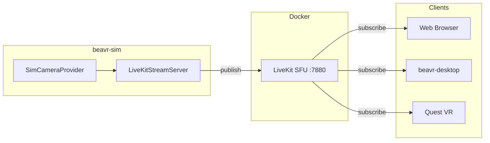

# beavr-network Architecture

## Video Streaming Flow

## Key Components

| Component | Port | Description |
|-----------|------|-------------|
| LiveKit SFU | 7880 | WebRTC signaling server (Docker) |
| LiveKitStreamServer | 8080 | HTTP `/info` endpoint + video publisher |
| SimCameraProvider | - | MuJoCo camera frame capture |

## Connection Flow

1. Client fetches `GET /info` from LiveKitStreamServer (port 8080)
2. Response contains: `livekit_url`, `room`, `resolution`, `fps`
3. Client connects to LiveKit SFU and joins the room
4. Client subscribes to video track published by `sim-camera`

